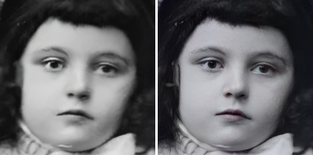
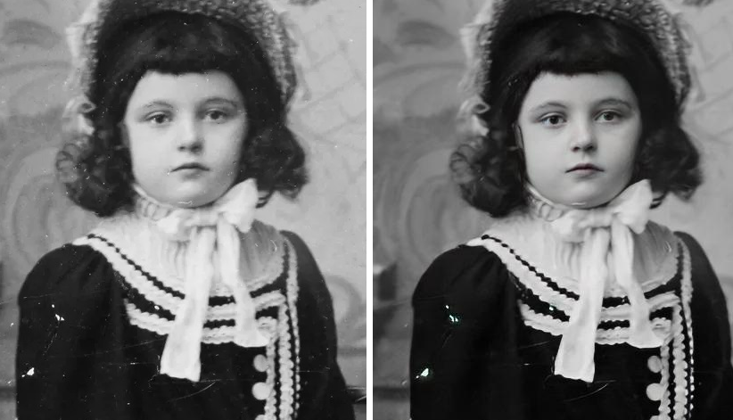
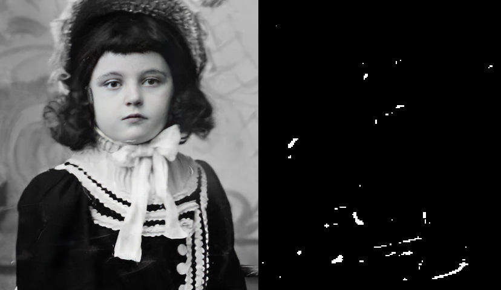

# TensorFlow v2+Keras re-implementation of 'Old Photo Restoration via Deep Latent Space Translation', CVPR 2020 paper
This is a *TensorFlow v2+Keras* inference ONLY implemention of a [CVPR 2020 paper](https://arxiv.org/abs/2004.09484) that restores old photos sufferring from degradations like faded colors, scratches and color spots by jointly learning from the latent spaces of paired artificially degraded images and real degraded photos. This repo provides a 'cleaner' version of the original implementation and removes dependecies on some libraries.

The whole process consists of the following steps:
* Stage 1 - Scratch mask detection (Optional)
* Stage 2 - Image enhancement
* Stage 3 - Face detection (Third party model)
* Stage 4 - Face enhancement
* Stage 5 - Blend enhanced face image back into enhanced image

Official PyTorch implementation can be found [here](https://github.com/microsoft/Bringing-Old-Photos-Back-to-Life).

*[25th March 2021] The official repository has been updated with training code for the model. It is unlikely that this new changes will be re-implemented here.*

# Results
NOTE: Images shown below have been taken from [The United States Library of Congress](https://www.loc.gov/free-to-use/)'s 'free to use and reuse' photo archives.

* Face enhancement

* Face detection, enhancement and Image enhancement *BUT without scratch removal stage*

* Scratch detection mask and Image enhancement with scratch removal stage

# Requirements
The following software versions were used for testing the code in this repo.
* Python 3.7
* PyTorch 1.8*
* Tensorflow 2.4.1
* CUDA 11.1
* Pip 21.0.1
* Microsoft Visual Studio 2019 (if using .sln file)
* Other required python libraries are in 'requirements.txt'

*NOTE: As of the date of the publication of this repo, DLib is only available for Python 3.6 or lower with Pip. You could either use Python 3.6 or recompile DLib yourselves.*

\**Required for weights conversion*

# Getting started
Download all PyTorch and DLib weights from official repo (see page top). Then convert PyTorch weights to Tensorflow checkpoint format weights using:

**For pipeline WITHOUT scratch detection**

1. `python convert_weights_for_tf.py --input_weights netG_A ./weights/Image_Enhancement/restoration/VAE_A_quality/latest_net_G.pth netG_B ./weights/Image_Enhancement/restoration/VAE_B_quality/latest_net_G.pth mapping_net ./weights/Image_Enhancement/restoration/mapping_quality/latest_net_mapping_net.pth --stage 2 --output_weights ./weights/Image_Enhancement/stage2_without_scratch/tf_keras.weights`
2. `python convert_weights_for_tf.py --input_weights netG ./weights/Face_Enhancement/Setting_9_epoch_100/latest_net_G.pth --stage 3 --output_weights ./weights/Face_Enhancement/stage3/tf_keras.weights`

**For pipeline WITH scratch detection**

1. `python convert_weights_for_tf.py --input_weights unet ./weights/Image_Enhancement/detection/FT_Epoch_latest.pt --stage 1 --output_weights ./weights/Image_Enhancement/stage1_with_scratch/tf_keras.weights`
2. `python convert_weights_for_tf.py --with_scratch --input_weights netG_A ./weights/Image_Enhancement/restoration/VAE_A_quality/latest_net_G.pth netG_B ./weights/Image_Enhancement/restoration/VAE_B_scratch/latest_net_G.pth mapping_net ./weights/Image_Enhancement/restoration/mapping_scratch/latest_net_mapping_net.pth --stage 2 --output_weights ./weights/Image_Enhancement/stage2_with_scratch/tf_keras.weights`
3. `python convert_weights_for_tf.py --input_weights netG ./weights/Face_Enhancement/Setting_9_epoch_100/latest_net_G.pth --stage 3 --output_weights ./weights/Face_Enhancement/stage3/tf_keras.weights`

Then inference can be done in a folder of input images using:

**For pipeline WITHOUT scratch detection**

`python main.py --input_folder <Folder with images> --checkpoint ./weights/Image_Enhancement/stage2_without_scratch/tf_keras.weights --gpu_id 0`

**For pipeline WITH scratch detection**

`python main.py --input_folder <Folder with images> --checkpoint ./weights/Image_Enhancement/stage1_with_scratch/tf_keras.weights ./weights/Image_Enhancement/stage2_with_scratch/tf_keras.weights ./weights/Face_Enhancement/stage3/tf_keras.weights --gpu_id 0`

*NOTE: To run on CPU rather than GPU, just omit the '--gpu_id' argument during inference.*

# License
>Any part of this source code can ONLY be reused for research purposes with citation. This repo contains some modified source code from third-party sources who have been credited in files where they were used. Any commercial use of any part of this code requires a formal request to this repo's author.

# References
>Wan, Ziyu and Zhang, Bo and Chen, Dongdong and Zhang, Pan and Chen, Dong and Liao, Jing and Wen, Fang, 2020. Bringing Old Photos Back to Life. In proceedings of the IEEE/CVF Conference on Computer Vision and Pattern Recognition (pp. 2747-2757)